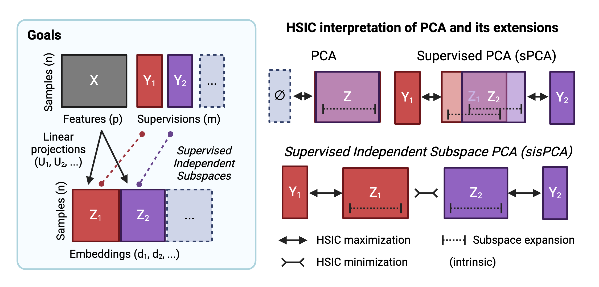

Welcome
=======

.. toctree::
  :maxdepth: 2
  :hidden:
  :caption: Getting Started

  self
  tutorials/index

.. toctree::
  :maxdepth: 2
  :hidden:
  :caption: API Reference

  autoapi/sispca/index

`SISPCA (Supervised Independent Subspace Principal Component Analysis) <https://github.com/JiayuSuPKU/sispca>`_ is a Python package designed to learn linear representations capturing variations associated with factors of interest in high-dimensional data.
It extends the Principal Component Analysis (PCA) to multiple subspaces and encourage subspace disentanglement by maximizing the Hilbert-Schmidt Independence Criterion (HSIC).
The model is implemented in `PyTorch <https://pytorch.org/>`_ and uses the `Lightning framework <https://lightning.ai/docs/pytorch/stable/>`_ for training.

For more theoretical connections and applications, please refer to our paper
`Disentangling Interpretable Factors with Supervised Independent Subspace Principal Component Analysis <https://arxiv.org/abs/2410.23595>`_.

.. note::

  This documentation is under active development.

Installation
------------
The package can be installed via pip:

.. code-block:: zsh

  # from PyPI (stable version)
  $ pip install sispca

  # or from github (latest version)
  $ pip install git+https://github.com/JiayuSuPKU/sispca.git#egg=sispca

The following dependencies will be installed automatically:

.. code-block:: text

  torch # may need to install with specific python version
  lightning
  scipy
  scikit-learn

In addition to the linear PCA models, we also re-implemented non-linear VAE-based counterparts in `sispca.hcv_vi` following
the `HCV paper (Lopez et al. 2018) <https://github.com/romain-lopez/HCV/tree/master>`_ under the latest `scvi-tools framework <https://docs.scvi-tools.org/en/stable/index.html>`_ (version 1.2.0).
To run those models, you need to also install the following dependencies:

.. code-block:: zsh

  $ pip install scanpy
  $ pip install scvi-tools

Please refer to the `scvi-tools documentation <https://docs.scvi-tools.org/en/stable/installation.html>`_ for installation instruction.

Basic usage
-----------
.. code-block:: python

  import numpy as np
  import torch
  from sispca import Supervision, SISPCADataset, SISPCA

  # simulate random inputs
  x = torch.randn(100, 20)
  y_cont = torch.randn(100, 5) # continuous target
  y_group = np.random.choice(['A', 'B', 'C'], 100) # categorical target
  L = torch.randn(100, 20)
  K_y = L @ L.T # custom kernel, (n_sample, n_sample)

  # create a dataset with supervision
  sdata = SISPCADataset(
      data = x.float(), # (n_sample, n_feature)
      target_supervision_list = [
          Supervision(target_data=y_cont, target_type='continuous'),
          Supervision(target_data=y_group, target_type='categorical'),
          Supervision(target_data=None, target_type='custom', target_kernel = K_y)
      ]
  )

  # fit the sisPCA model
  sispca = SISPCA(
      sdata,
      n_latent_sub=[3, 3, 3, 3], # the last subspace will be unsupervised
      lambda_contrast=10,
      kernel_subspace='linear',
      solver='eig'
  )
  sispca.fit(batch_size = -1, max_epochs = 100, early_stopping_patience = 5)

Tutorials
---------

See the :ref:`Tutorial Gallery <gallery>` for examples on how to use the package.

Citation
-----------
If you find this work useful, please consider citing our paper:

.. code-block:: bibtex

  @misc{su2024disentangling,
    title={Disentangling Interpretable Factors with Supervised Independent Subspace Principal Component Analysis},
    author={Jiayu Su and David A. Knowles and Raul Rabadan},
    year={2024},
    eprint={2410.23595},
    archivePrefix={arXiv},
    primaryClass={stat.ML},
    url={https://arxiv.org/abs/2410.23595},
  }
